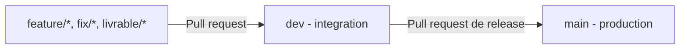

# Flux Git EventHub

`main` contient la version de production. `dev` est la branche d'integration.
Les branches de travail sont ephemeres et partent de `dev`.



## Regles

- Ne pas pousser directement sur `main` ou `dev`; ouvrir une pull request.
- `feature/<numero>-<sujet>` pour une fonctionnalite, `fix/<numero>-<sujet>` pour un correctif et `livrable/<sujet>` pour un rendu.
- Creer une branche depuis `dev`, puis ouvrir une pull request vers `dev`.
- Pour publier, ouvrir une pull request de `dev` vers `main`.
- Supprimer les branches ephemeres apres fusion.
- Les protections GitHub de `main` et `dev` imposent les pull requests, interdisent force-push et suppression, et s'appliquent aussi aux administrateurs. Le nombre d'approbations est a zero pour permettre le travail individuel; les verifications de CI seront ajoutees quand le projet en aura.

## Commandes

```bash
git switch dev
git pull --ff-only
git switch -c feature/12-description
# effectuer les changements et les commits
git push -u origin feature/12-description
```

Ouvrir ensuite une pull request `feature/12-description` vers `dev`. Les livraisons passent par une pull request `dev` vers `main`.
